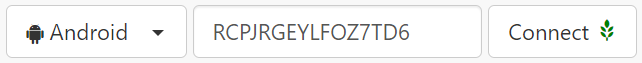
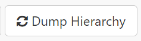
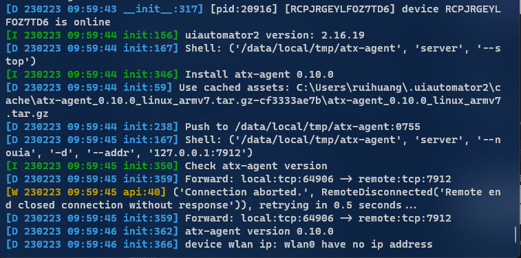
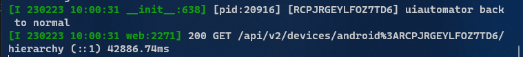
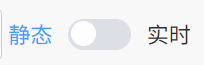
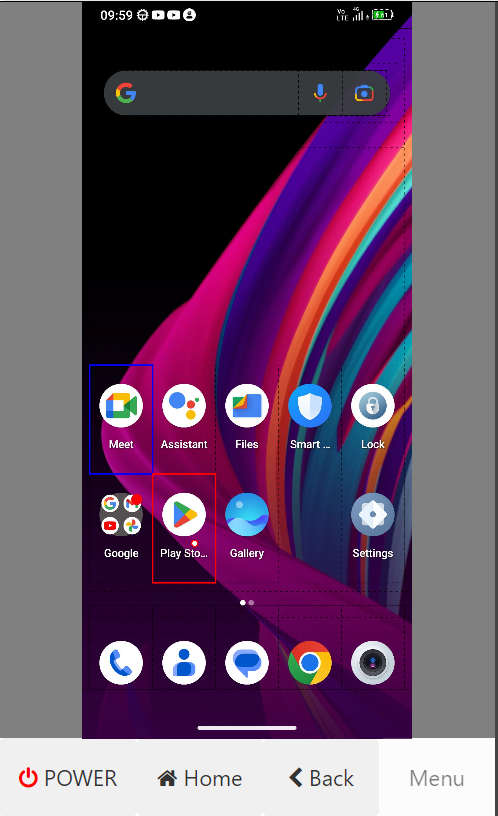
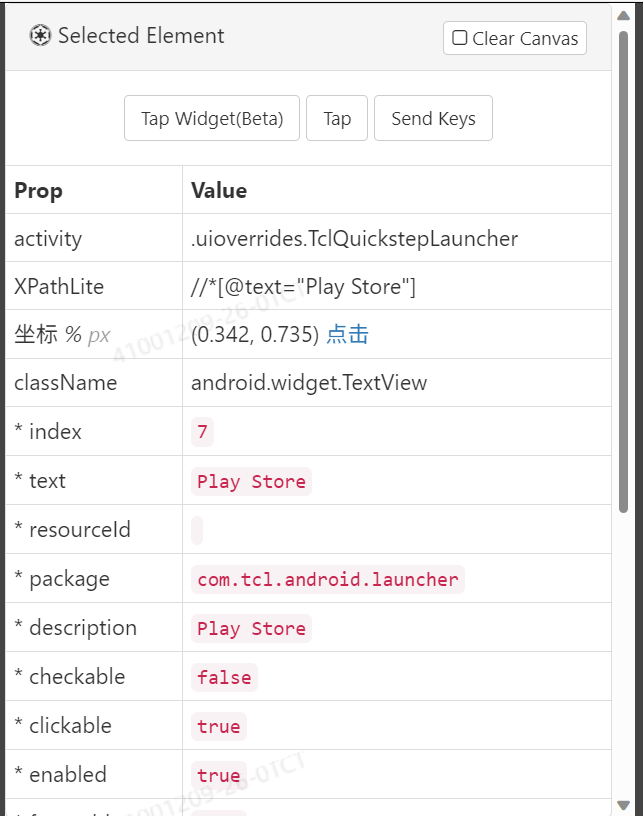
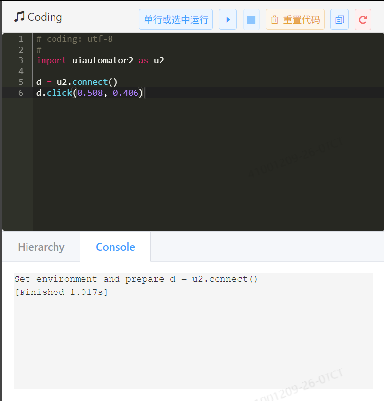
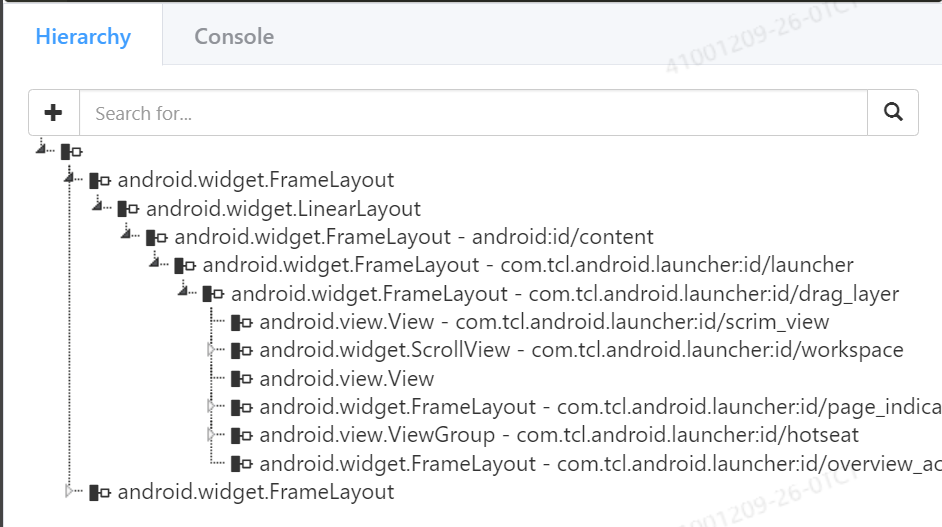

# Weditor使用入门

## 安装

安装完UiAutomator2后，使用pip安装weditor：

```bash
pip install -U weditor
```

安装好之后，就可以在命令行运行`weditor --help` 确认是否安装成功了。

> Windows系统可以使用命令在桌面创建一个快捷方式 `weditor --shortcut`，如果使用的是Conda、PyCharm venv等虚拟环境，则快捷方式无效


## 启动

使用如下命令：

```bash
python -m weditor
```

将会在默认浏览器里面启动weditor，界面如下：


## 使用

### 连接设备

通过adb获取设备序列号：

```bash
adb devices
```

粘贴到中间的输入框里：

点击“Dump Hierarchy”按钮



可以在终端观察到uiautomator2开始初始化：



稍等片刻后出现如下信息即表示成功：



此后点击一次“Dump Hierarchy”即可获取一次界面信息

切换如下开关至“实时”，将会自动循环获取界面信息：




### 获取Android界面元素信息

在左侧预览窗口，鼠标悬浮于元素上，对应的元素将会以蓝框显示，此时点击此元素即可锁定此元素，蓝框将会变为红框。

双击选中元素，将通过UiAutomator2对手机进行控制。

底部分别是电源键、三大金刚键（桌面、返回、菜单），点击可对手机进行控制。



页面中部窗口展示了所有选定的元素的信息：




### 代码调试

右侧窗口是一个简易的Python开发环境，可用于简单UiAutomator2代码的测试：




### Hierarchy

将右侧下部的标签从Console切换为Hierarchy，即可看到当前Android显示页面的所有UI元素层级关系。

单击选中可在中部窗口显示信息，搜索栏可输入关键字搜索以匹配对应的元素：

